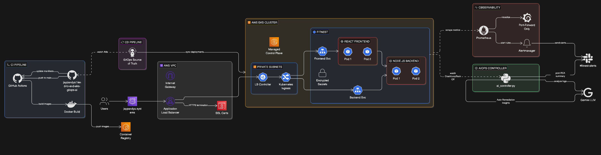

# 🚀 GitOps Platform Engineering on AWS EKS


---

## 🧭 Summary
Engineered a **highly available, self-healing GitOps platform** on AWS EKS that automates infrastructure provisioning, secure delivery, and continuous observability. This portfolio-grade system demonstrates **platform engineering** principles, combining **GitOps, IaC, and AIOps** to deliver reliable, scalable cloud operations.

---

## 🏗️ Architecture (Platform + GitOps Flow)


## 🔑 Key Infrastructure Pillars

### ✅ Automated CI/CD (GitOps)
- **GitHub Actions** builds and pushes container images to **ECR**
- **ArgoCD** continuously syncs Kubernetes manifests for **zero‑downtime delivery**

### 🔐 Enterprise Security
- **Bitnami Sealed Secrets** enables cryptographic secret management (Git‑safe)

### 📈 Active Observability
- **Prometheus + Grafana + Alertmanager** with Slack-based incident routing

### 🧠 AIOps & Auto‑Triage
- **Custom Python controller** watches Kubernetes crashes and generates LLM-based RCA for `CrashLoopBackOff` events

---

## 🧰 Core Tech Stack

**Platform & Cloud**
- AWS (EKS, ECR, VPC, IAM)
- Terraform (modular IaC)

**Kubernetes & GitOps**
- Kubernetes (manifests in `k8s/`)
- ArgoCD (GitOps controller)

**Observability**
- Prometheus
- Grafana
- Alertmanager → Slack

**AIOps**
- Python + Kubernetes API
- Gemini LLM for root-cause diagnostics

**CI/CD**
- GitHub Actions
- Docker

---

## 🗂️ Repository Structure (Infrastructure Focus)

```text
.
├── .github/workflows/        # GitHub Actions CI pipeline
│   └── deploy.yaml
├── terraform/                # Modular IaC for VPC, EKS, ECR
│   ├── main.tf
│   ├── variables.tf
│   ├── outputs.tf
│   └── modules/
│       ├── vpc/
│       ├── eks/
│       └── ecr/
├── k8s/                      # GitOps source of truth (manifests)
│   ├── backend/
│   ├── frontend/
│   ├── database/
│   ├── namespace.yaml
│   ├── fitness-ingress.yaml
│   └── fitness-secrets.yaml
├── argocd-app.yaml           # ArgoCD application definition
├── alertmanager-values.yaml  # Alert routing to Slack
├── sealed-secret.yaml         # Encrypted secrets (Bitnami Sealed Secrets)
├── ai_controller.py           # AIOps controller for crash diagnostics
```

---

## 🚀 Getting Started (High‑Level Deployment)

1. **Provision AWS infrastructure**
   - Use Terraform in `terraform/` to create VPC, EKS cluster, and ECR.

2. **Bootstrap GitOps**
   - Install ArgoCD in the cluster.
   - Apply `argocd-app.yaml` to sync manifests in `k8s/`.

3. **Deploy CI/CD**
   - Push to `main` triggers GitHub Actions to build and publish images to ECR.

4. **Enable observability**
   - Deploy Prometheus/Grafana stack.
   - Apply `alertmanager-values.yaml` and `sealed-secret.yaml` to route alerts to Slack.

---

---